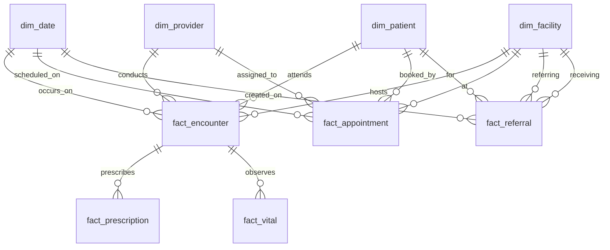

# Dimensional / Analytical Data Model Specification
**Healthcare Platform — Data Engineering & Records (Phase 4)**

## 1. Executive Overview

The Analytical Data Model provides an optimized **Star Schema** within the PostgreSQL `analytics` schema. It decouples analytical querying, cohort generation, and executive KPI reporting from the operational OLTP database schema (`public`).

### Core Design Principles
1. **Data Minimization & Patient Privacy**: `dim_patient` uses synthetic surrogate keys (`patient_key`). Direct patient identifiers (`first_name`, `last_name`, `phone`, `email`, `address`) are strictly excluded from the analytical layer.
2. **Explicit Fact Table Grains**: Every fact table has a mathematically defined grain to eliminate double-counting risks when aggregating across clinical domains.
3. **Surrogate Keys**: Integer surrogate primary keys (`BIGSERIAL`) decouple analytical models from operational UUID volatility.
4. **Calendar Dimensionality**: `dim_date` precomputes calendar and temporal attributes for 2020 through 2030, avoiding expensive runtime timestamp parsing.

---

## 2. Star Schema Architecture



---

## 3. Dimension Tables

### 3.1 `analytics.dim_date`
- **Purpose**: Conformed temporal dimension for time-series trend analysis, seasonality, and clinical scheduling.
- **Grain**: One row represents one calendar date.
- **Coverage**: 2020-01-01 to 2030-12-31 (4,018 rows).
- **Primary Key**: `date_key` (INTEGER YYYYMMDD, e.g. `20260902`).
- **Attributes**: `full_date`, `day`, `day_of_week`, `day_of_week_num`, `week`, `month`, `month_name`, `quarter`, `year`, `is_weekend`.

### 3.2 `analytics.dim_patient`
- **Purpose**: Conformed patient demographic dimension supporting demographic segmentation and epidemiological cohorts.
- **Grain**: One row represents one patient entity.
- **Primary Key**: `patient_key` (BIGSERIAL).
- **Business Key**: `patient_id` (UUID).
- **Attributes**: `source_patient_id` (hospital ID), `abha_id` (ABDM 14-digit identifier), `gender`, `date_of_birth`, `age_band` (`0-5`, `6-17`, `18-35`, `36-60`, `60+`), `blood_group`, `district`, `state`, `source_system`.
- **SCD Type 2 Attributes**: `effective_from`, `effective_to`, `is_current`.
- **Privacy Enforcement**: Direct identifiers (`first_name`, `last_name`, `phone`, `email`, `address`) are **NOT** stored in `analytics.dim_patient`.

### 3.3 `analytics.dim_provider`
- **Purpose**: Healthcare worker and clinical provider dimension.
- **Grain**: One row represents one healthcare provider.
- **Primary Key**: `provider_key` (BIGSERIAL).
- **Business Key**: `provider_id` (INTEGER).
- **Attributes**: `role` (`doctor`, `nurse`, `admin`, `specialist`), `is_active`.

### 3.4 `analytics.dim_facility`
- **Purpose**: Healthcare delivery facility dimension supporting rural tier analysis.
- **Grain**: One row represents one healthcare facility.
- **Primary Key**: `facility_key` (BIGSERIAL).
- **Business Key**: `facility_id` (UUID).
- **Attributes**: `facility_name`, `facility_code`, `facility_tier` (`PHC`, `CHC`, `DISTRICT_HOSPITAL`, `SUB_CENTRE`), `is_active`.

### 3.5 `analytics.dim_geography`
- **Purpose**: Regional hierarchy dimension for geographic workload and epidemiology.
- **Grain**: One row represents one administrative district/state region.
- **Primary Key**: `geography_key` (BIGSERIAL).
- **Attributes**: `district`, `state`, `country`, `rural_urban`.

---

## 4. Fact Tables

### 4.1 `analytics.fact_appointment`
- **Grain**: One row represents one appointment booking occurrence.
- **Primary Key**: `appointment_key` (BIGSERIAL).
- **Foreign Keys**:
  - `date_key` $\rightarrow$ `dim_date.date_key`
  - `patient_key` $\rightarrow$ `dim_patient.patient_key`
  - `provider_key` $\rightarrow$ `dim_provider.provider_key`
  - `facility_key` $\rightarrow$ `dim_facility.facility_key`
- **Measures**: `wait_minutes` (NUMERIC).
- **Flags**: `is_completed` (BOOLEAN), `is_cancelled` (BOOLEAN), `is_no_show` (BOOLEAN).

### 4.2 `analytics.fact_encounter`
- **Grain**: One row represents one recorded clinical consultation/encounter visit.
- **Primary Key**: `encounter_key` (BIGSERIAL).
- **Foreign Keys**:
  - `date_key` $\rightarrow$ `dim_date.date_key`
  - `patient_key` $\rightarrow$ `dim_patient.patient_key`
  - `provider_key` $\rightarrow$ `dim_provider.provider_key`
  - `facility_key` $\rightarrow$ `dim_facility.facility_key`
- **Attributes**: `encounter_type`, `encounter_status`.
- **Measures**:
  - `duration_minutes` (NUMERIC)
  - `diagnosis_count` (INTEGER)
  - `prescription_count` (INTEGER)
  - `has_vitals` (BOOLEAN)

### 4.3 `analytics.fact_referral`
- **Grain**: One row represents one referral episode between facilities.
- **Primary Key**: `referral_key` (BIGSERIAL).
- **Foreign Keys**:
  - `created_date_key` $\rightarrow$ `dim_date.date_key`
  - `completed_date_key` $\rightarrow$ `dim_date.date_key`
  - `patient_key` $\rightarrow$ `dim_patient.patient_key`
  - `referring_facility_key` $\rightarrow$ `dim_facility.facility_key`
  - `receiving_facility_key` $\rightarrow$ `dim_facility.facility_key`
- **Measures**: `completion_days` (NUMERIC).
- **Flags**: `is_completed` (BOOLEAN), `is_cancelled` (BOOLEAN).

### 4.4 `analytics.fact_prescription`
- **Grain**: One row represents one prescribed medication line item.
- **Primary Key**: `prescription_key` (BIGSERIAL).
- **Foreign Keys**:
  - `date_key` $\rightarrow$ `dim_date.date_key`
  - `patient_key` $\rightarrow$ `dim_patient.patient_key`
  - `encounter_key` $\rightarrow$ `fact_encounter.encounter_key`
- **Attributes**: `prescription_id`, `medication_id`, `prescription_status`.
- **Measures**: `quantity`, `duration_days`.

### 4.5 `analytics.fact_vital`
- **Grain**: One row represents one clinical physiological observation panel recorded during an encounter.
- **Primary Key**: `vital_key` (BIGSERIAL).
- **Foreign Keys**:
  - `date_key` $\rightarrow$ `dim_date.date_key`
  - `patient_key` $\rightarrow$ `dim_patient.patient_key`
  - `encounter_key` $\rightarrow$ `fact_encounter.encounter_key`
- **Measures**:
  - `systolic_bp` (mmHg)
  - `diastolic_bp` (mmHg)
  - `heart_rate` (bpm)
  - `temperature` (°C)
  - `spo2` (%)
  - `respiratory_rate` (breaths/min)
- **Quality Status**: `quality_status` (`valid`, `invalid`, `incomplete`).

---

## 5. Double-Counting Prevention Strategy

| Analytical Join | Hazard | Prevention Mechanism |
|---|---|---|
| `fact_encounter` $\bowtie$ `fact_prescription` | Joining encounters with prescriptions multiplies encounter rows by the medication count (1 encounter with 3 prescriptions $\rightarrow$ 3 rows). | Aggregate `fact_prescription` to encounter level (`COUNT(*) AS prescription_count`) **BEFORE** joining to `fact_encounter`, or query `fact_encounter.prescription_count` directly. |
| `fact_encounter` $\bowtie$ `fact_vital` | Multiple vital panels could multiply encounter rows. | Query `fact_encounter.has_vitals` for visit-level metrics, or join `fact_vital` using a 1:1 aggregated CTE. |
| `dim_patient` $\bowtie$ `fact_encounter` | Patient volume vs encounter volume confusion. | Always use `COUNT(DISTINCT patient_key)` for patient cohorts, and `COUNT(*)` for visit volume. |

---

## 6. Validated Production Analytical Queries

### Query 1: Patient Encounters per Patient
```sql
SELECT
    p.patient_key,
    COUNT(*) AS encounter_count
FROM analytics.fact_encounter e
JOIN analytics.dim_patient p
    ON e.patient_key = p.patient_key
GROUP BY p.patient_key;
```

### Query 2: Facility Workload Distribution
```sql
SELECT
    f.facility_name,
    COUNT(*) AS encounters
FROM analytics.fact_encounter e
JOIN analytics.dim_facility f
    ON e.facility_key = f.facility_key
GROUP BY f.facility_name
ORDER BY encounters DESC;
```

### Query 3: Referral Completion Rate & Turnaround Time
```sql
SELECT
    COUNT(*) AS total_referrals,
    SUM(CASE WHEN is_completed THEN 1 ELSE 0 END) AS completed_referrals,
    ROUND(100.0 * SUM(CASE WHEN is_completed THEN 1 ELSE 0 END) / COUNT(*), 2) AS completion_rate_pct,
    ROUND(AVG(completion_days) FILTER (WHERE is_completed = TRUE), 2) AS avg_completion_days
FROM analytics.fact_referral;
```
