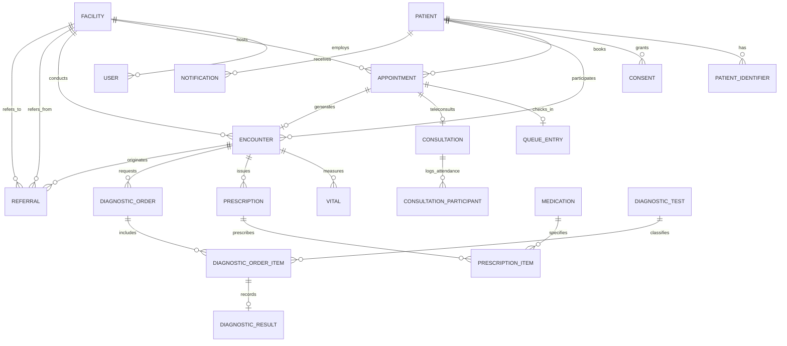

# Data Architecture Specification — Phase 0

## 1. Operational Entity Relationships

The operational transactional system in PostgreSQL models primary healthcare encounters, patient appointments, clinical interventions, diagnostic workflows, and teleconsultations across tier-1 primary health centres (PHCs) and district hospitals.

### Entity Relationship Diagram (ERD)



---

## 2. Multi-Layer Data Engineering Architecture

The platform follows an **ELT (Extract, Load, Transform)** paradigm. Data is ingested faithfully without premature transformations to guarantee full auditability and reproducible lineage.

```
┌────────────────────────────────────────────────────────┐
│               OPERATIONAL DATA LAYER                   │
│   PostgreSQL Transactional Database (24 Live Tables)   │
└──────────────────────────┬─────────────────────────────┘
                           │
                           │ 1. Read-Only Extract
                           ▼
┌────────────────────────────────────────────────────────┐
│                      RAW LAYER                         │
│  - Immutable historical dumps / append-only logs       │
│  - Exact fidelity with source database schemas         │
│  - Retains source metadata: _extracted_at, _source_id │
└──────────────────────────┬─────────────────────────────┘
                           │
                           │ 2. Standardize & Validate
                           ▼
┌────────────────────────────────────────────────────────┐
│                    STAGING LAYER                       │
│  - Column renaming & ISO-8601 timestamp casting       │
│  - De-duplication & surrogate key assignment           │
│  - Range validation & invalid code quarantine          │
│  - Null handling (explicit flags for unknown/missing) │
└──────────────────────────┬─────────────────────────────┘
                           │
                           │ 3. Dimensional Modeling
                           ▼
┌────────────────────────────────────────────────────────┐
│                   ANALYTICS LAYER                      │
│                                                        │
│   DIMENSIONS                      FACTS                │
│   - dim_patient (SCD Type 2)      - fact_encounter     │
│   - dim_facility                  - fact_appointment   │
│   - dim_provider                  - fact_vitals        │
│   - dim_medication                - fact_prescription  │
│   - dim_diagnostic_test           - fact_diagnostic    │
│   - dim_date                      - fact_referral      │
│                                   - fact_consultation  │
└──────────────────────────┬─────────────────────────────┘
                           │
                           │ 4. Aggregations & Metrics
                           ▼
┌────────────────────────────────────────────────────────┐
│             ANALYTICS CONSUMPTION LAYER                │
│  - Cohort Builder (Hypertension, Diabetes, Antenatal)  │
│  - Facility KPI Dashboards (Wait times, Bed turnover)  │
│  - Quality Monitoring (Referral completion, Stockout)  │
└────────────────────────────────────────────────────────┘
```

---

## 3. Rationale: ELT vs. ETL

1. **Auditability & Traceability**: In healthcare, transformations cannot destroy source context. If an anomaly is identified, we must be able to inspect what the raw transactional database recorded.
2. **Reproducibility**: When data transformation rules change (e.g., revised hypertension categorization thresholds), ELT allows recalculating historical metrics from raw snapshots without needing operational re-extraction.
3. **Decoupled Workloads**: Heavy analytical window functions, join graphs, and cohort aggregations run independently of the transactional database, protecting clinical response times.

---

## 4. Lineage Tracking Standard

Every row in the downstream analytical warehouse will carry lineage tracking columns:
- `_extracted_at`: UTC timestamp of source database read.
- `_source_table`: Name of the operational source table.
- `_source_pk`: The primary key in the operational database (e.g. UUID).
- `_transformation_version`: Hash or release version of the transformation pipeline.
